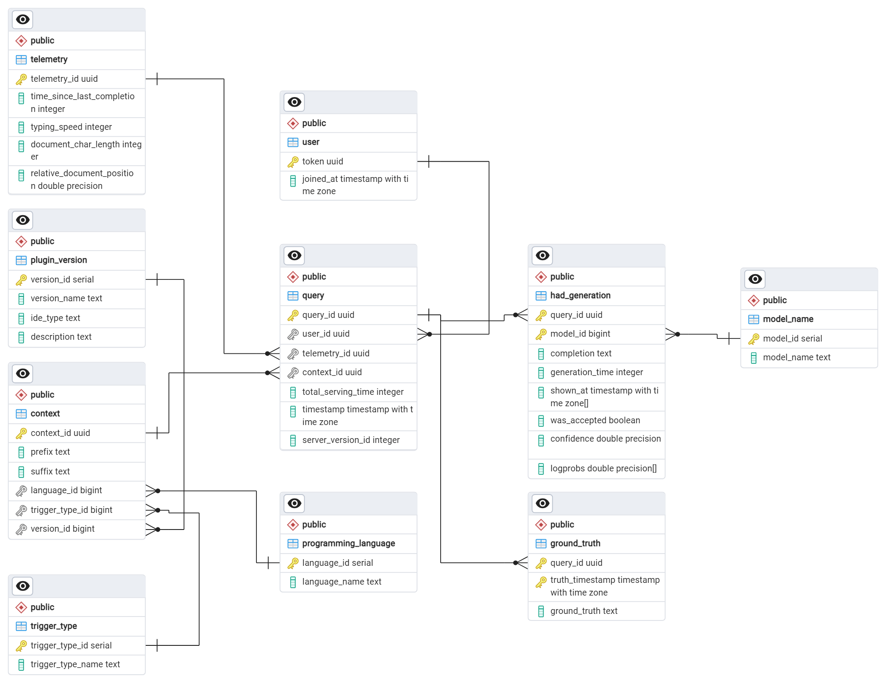

## Database Schema for CoCo

**Note: image of database design available at the end of the document**


## Tables
### `user`
This is the table which contains the list of all the valid identification tokens for the users.
This table can therefore also be used to verify the fact that a user is a valid user or not upon a request.

- **`token_uuid: UUID`** Unique identifier for the user, **Primary Key**. 
- `joined_at: TIMESTAMP` Timestamp at which the user joined.

### `version_id`
This table contains the list of all the versions of the plugin that are available bound to the `ide_type`.
The (optional) description field can be used to provide a brief description of the version and the changes that have been made in the version.

- **`version_id: INTEGER`** Unique identifier for the version. **Primary Key**.
- `version_name: TEXT` Name of the (semantic) version.
- `ide_type: TEXT` Type of the IDE for which the version is available.
- `description: TEXT` Description of the version, *Optional*.

### `trigger_type`
This table contains the list of all the trigger types that are available.
The trigger types are used to determine the type of trigger that is used to generate the code.

- **`trigger_type_id: INTEGER`** Unique identifier for the trigger type, **Primary Key**.
- `trigger_type_name: TEXT` Name of the trigger type.

### `programming_language`
This table contains the list of all the programming languages that are available.
The programming languages are used to determine the language in which the code is generated.

- **`language_id: INTEGER`** Unique identifier for the programming language, **Primary Key**.
- `language_name: TEXT` Name of the programming language.

### `model_name`
This table contains the list of all the models that are available.
The models are used to determine the model that is used to generate the code.

- **`model_id: INTEGER`** Unique identifier for the model, **Primary Key**.
- `model_name: TEXT` Name of the model.

### `query`
This table contains the list of all the generations that have been requested.
This table is the central table in the database and contains all the metadata related to the generation request.

###### Computed Server-Side

- **`query_id: UUID`** for the generation request, **Primary Key**.
- `total_serving_time: INTEGER` total request processing time, in milliseconds.
- `query_timestamp: TIMESTAMP` timestamp at which the query was made.
- `telemetry_id: UUID` &rarr; [`telemetry`](#telemetry) ID for the telemetry used.
- `context_id: UUID` &rarr; [`context`](#context) ID for the context used.
- `server_version_id: INTEGER` &rarr; [`version_id`](#version_id) ID for the server version used.


###### Computed Client-Side

- `user_id: UUID` &rarr; [`user`](#user) who requested the generation.
- `timestamp: TIMESTAMP` timestamp at which the query was made.

### `had_generation`

This table contains all the completions that have been generated; the actual code as well as generation-related metadata. 

###### Computed Server-Side
- **`query_id: UUID`** &rarr; [`query`](#query) Unique identifier for the query, **Primary Key**. 
- **`model_id: INTEGER`** &rarr; [`model_name`](#model_name) ID for the model used, **Primary Key**.
- `completion: TEXT` The code that has been generated.
- `generation_time: INTEGER` Time taken to generate the code, in milliseconds.
- `confidence: FLOAT` Confidence of the model in the generated code.

###### Computed Client-Side (& MUTABLE)

- `shown_at: TIMESTAMP[]` The times at which the completion was shown to the user.
- `was_accepted: BOOLEAN` Whether the completion was accepted or not.

### `ground_truth`
This table contains the ground truth for the completions that have been generated.
The ground truth is the code that the user was actually looking for when they requested the completion.

- **`query_id: UUID`** &rarr; [`query`](#query) Unique identifier for the generation request, **Primary Key**.
- **`truth_timestamp: TIMESTAMP`** Timestamp at which the ground truth was provided, **Primary Key**.
- `ground_truth_text: TEXT` The code that the user was actually looking for.

### `context`

This table contains the context for the generation request.

- **`context_id: UUID`** Unique identifier for the context, **Primary Key**.
- `prefix: TEXT` The code that comes before the cursor position.
- `suffix: TEXT` The code that comes after the cursor position.
- `language_id: INTEGER` &rarr; [`programming_language`](#programming_language) ID for the language used.
- `trigger_type_id: INTEGER` &rarr; [`trigger_type`](#trigger_type) ID for the trigger type used.
- `version_id: INTEGER` &rarr; [`version_id`](#version_id) ID for the version used.

### `telemetry`

This table contains the telemetry data for the generation request.

- **`telemetry_id: UUID`** Unique identifier for the telemetry data, **Primary Key**.
- `time_since_last_completion: INTEGER` Time since the last completion, in milliseconds.
- `typing_speed: INTEGER` Typing speed of the user at the time of the request.
- `document_char_length: INTEGER` Length of the document.
- `relative_document_position: DOUBLE` Relative position of the cursor in the document.

## General Notes
- The database has been designed in a way to enable modularity and scalability.
  - With the given schema it becomes very simple to add new models, trigger types, IDE types, programming languages, and versions.
  - The schema has been normalized to be in 3NF to minimize complications that might arise as the result of anomalies.
  - The schema has been designed to be scalable and can be easily extended to include more tables and fields as required.
- The database has been designed to favor OLTP operations over OLAP operations in order to provide a faster response time for the users.
- The database has been designed to be used with a REST API.

## Updates
*The database as presented in the init_sql file is basically the base schema for the database. The database is subject to change in the future as the requirements of the project change. A guide to adding updates to the database can be found [here](updates/updates.md)*

## design decisions
- all times which are stored as integers are stored in milliseconds. This is to ensure that the time taken to generate the code is stored in a consistent manner.
- a cascade of deletion has been implemented based upon the foreign key constraint of `request_id` in the table `completion`. This is to ensure that when a generation request is deleted, all the completions associated with that request are also deleted. This is to ensure that the database does not contain any orphaned entries.
- as per the design of postgreSQL the `TEXT` datatype is used to store large amounts of text. This is to ensure that the database can store the code that has been generated without any truncation. (this is synonymous with the `CLOB` datatype in Oracle and the `TEXT` datatype in MySQL)
- indexes have been added to the foreign key columns to ensure that the database can quickly retrieve the data that is required. This is to ensure that the database can quickly retrieve the data that is required. Additionally, indexes have been added to the Primary Key columns to ensure that the database can quickly preform point-wise lookups.
- the designs have been exclusively tested on postgreSQL and as such the syntax used in the initialization script is specific to postgreSQL. The script may need to be modified to work with other SQL databases.

The initialization script for the database can be found [here](init.sql)
The PGERD file for the database can be found [here](resources/design_files/db_schema.pgerd)

## TODO

#### Code Context for Retrieval-Augmented Generation
In the design process of the database, we need to think about how we will implement prefix/suffix/file storing. Copilot uses a highly custom prompt, incorporating snippets from relevant files as well as libraries. This is something we will want to copy rather sooner than later, so it's important. Specifically, we need to think of the following tradeoff/spectrum:

1. On the one hand, we can pre-compute the entire prompt for the model on the client side.
2. On the other hand, we can send all relevant information to the server, and compute the prompt on the server side. 

I'm in favour of option 2 as much as is possible, as it allows more flexibility in subsequent data analysis, as well as the option to do A/B prompt studies. But, it requires us to think more about the design of the database. Perhaps it makes sense to divide the `request` metadata into two types: 

- `code` containing the currently open file, its language, cursor position, related files, and API docstrings. 
- `telemetry` containing IDE-collected variables like the typing speed, potential completion settings, etc. 

Telemetry is pretty much unique on every request, so this should be easy to add. Code, on the other hand, can be shared between requests and we need to think of the most optimal way to store it. I think we should explore [`tree-sitter`](https://tree-sitter.github.io/tree-sitter/) for parsing the AST/dependency tree on the client side, and then handle storing nodes in this tree on the server-side. Specifically:

- The client parses the AST, and figures out whether there are diffs for a given node; This means we can minimise the request message size, only transmitting the info that is necessary. 
- The server stores the AST and checks if there are *library*-dependencies it has stored already.

<!-- These were my notes as I was formulating my thoughts
- A user will likely request a completion many times when in the same file. 
  - Is it fine to store just the cursor position on subsequent requests along with a diff of the file? 
  - I think? it is safe to assume uniqueness between users when it comes to their files. 
- Related files may also be changed over time
- API calls may be shared among users, how do we avoid storing common libraries' documentation (`numpy`, `pandas`) more than once?

```python
@dataclass
class File:
  content: str 

  open?: bool # whether this is the currently open file. 
  position?: (column: int, offset: int) # we need to be very delicate here to ensure we are at the exact location
                                       # i.e. write a lot, lot of tests. 
  language: languageid
```
-->

<!--
useful links
([adoption of AI correlates with code churn](https://www.gitclear.com/coding_on_copilot_data_shows_ais_downward_pressure_on_code_quality))
-->


#### User Patterns over Time
We will probably add more customisation options for users like the ability to turn off completions on a given language, or to use ghost-text style completion instead of Intellisense-style. It would be nice to put in a table to keep track of user settings and how they evolve over time as well. 

## Previous Discussions


> [!NOTE]: does it not make more sense to merge `version_name` and `version_id` into one field? If we use semantic versioning; this should suffice as an identifier. I.e. just have a field `version_id: TEXT` containing the semantic version. 
> In fact, I would actually put this under `ide_type`, given that we may have different versions per IDE. Ideally we would keep the versions between different IDEs in sync, but in the real world we will run into bugs and probably push `x.x.1` little updates to each plugin. So my proposal becomes:

```
# plugin_version
- `version_id`: primary key
- `ide_type`: primary key
- `description`: text


query has plugin_version (rather than both ide_type and version_id)
plugin_version has ide_type 
```

> [!REMARK]: I do agree with you that probably moving the ide_type to the plugin_version table would be a better idea. This would allow for a more modular design and would allow for same versions for different ide_types and with different feature sets at each given version.
> 
> I do have a remark/concern about having `version_id` and `ide_type` as a composite primary key in the `plugin_version` table. Given that these two, together, are the identifier of a given description having them both would be necessary in the query table to properly identify the relevant version of the plugin. Additionally, what you point at was also my intention with how I designed the table in the first place. To have the version_id be a single integer value as the id and then the version be as you describe it. With this, adding additional columns to the plugin_version would not cause any anomalies down the line. (take an AB test scenario where you need an optional column to store the test group for example of a given ide version)
> 
> So to wrap this up I propose the following:

```
# plugin_version
- `version_id`: Integer PK
- `version_name`: TEXT
- `ide_type`: TEXT
- `description`: TEXT

removal of the ide_type table and the renaming of the version_id table to plugin_version 
```
> [!NOTE] Is it necessary for `trigger_type`, `ide_type`, `programming_language`, and `model_name` to be their own tables? I'm not sure if this works with the database libraries you're using (or whether it remains 3NF), but a flatter layout can be more desirable for easier understanding. 

> For instance, say I'm given a completion; to figure out whether it was invoked in `jetbrains` I need to look up the `ide_type_id` and then its corresponding `ide_name`. For someone not familiar with the plugin, knowing what values this can take requires exploring each table; and potentially keeping track of nesting and ids in data analysis. 

> I'm not sure if there is a better way of doing it, you probably know better. If the option exists, I would add these four as (extensible) enum values on the `completion` table. Otherwise, can you explain to me why this is better (e.g. I don't have enough experience with databases to know whether these things are automatically flattened when retrieving a `generation`)

> [!REMARK] I do agree with you that having the tables as separate entities does make it harder to understand the database schema. I do think that having the tables as separate entities does provide a certain level of modularity to the database schema. This would allow for the addition of new trigger types, programming languages, and models without having to change the schema of the database. Additionally, given that these two tables would be decoupled, it is less likely to have any sort of anomalies pop up given a potential changes in values or the addition of new values. Additionally, take the case we would want to also track versions of programming languages a user is utilizing to for example evaluate the acceptance of the completions generated when a user is programming in a older versino of java as opposed to a newer version. 
> 
> One more this to keep in mind, is that with the adapters that will be implemented on top of the database the data would be returned as the pydantic types that are defined for the project, so this is simply a level of abstraction that a user or analyst would not have to deal with. Everything will be handled through the providers of the adapter in the format that is "flattened".


---
#### Image of database design


