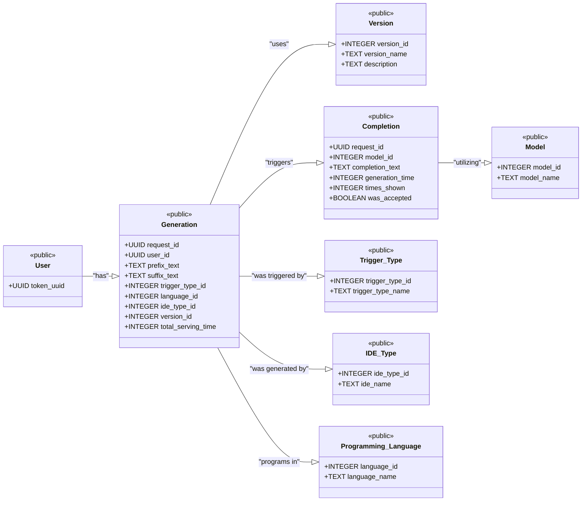

# Database Schema for CoCo

**Note: image of database design available at the end of the document**

## Tables
### User
This is the table which contains the list of all the valid identification tokens for the users.
This table can therefore also be used to very the fact that a user is a valid user or not upon request.
- token_uuid: UUID
  - Unique identifier for the user
  - Primary Key

### version_id
This table contains the list of all the versions of the plugin that are available.
The (optional) description field can be used to provide a brief description of the version and the changes that have been made in the version.

- version_id: INTEGER
  - Unique identifier for the version
- version_name: TEXT
  - Name of the version
  - Primary Key
- description: TEXT
  - Description of the version
  - Optional

### trigger_type
This table contains the list of all the trigger types that are available.
The trigger types are used to determine the type of trigger that is used to generate the code.

- trigger_type_id: INTEGER
  - Unique identifier for the trigger type
  - Primary Key
- trigger_type_name: TEXT
  - Name of the trigger type

### ide_type
This table contains the list of all the IDE types that are available.
The IDE types are used to determine the name/type of IDE that is used to generate the code.

- ide_type_id: INTEGER
  - Unique identifier for the IDE type
  - Primary Key
- ide_name: TEXT
  - Name of the IDE used

### programming_language
This table contains the list of all the programming languages that are available.
The programming languages are used to determine the language in which the code is generated.

- language_id: INTEGER
  - Unique identifier for the programming language
  - Primary Key
- language_name: TEXT
  - Name of the programming language

### model_name
This table contains the list of all the models that are available.
The models are used to determine the model that is used to generate the code.

- model_id: INTEGER
  - Unique identifier for the model
  - Primary Key
- model_name: TEXT
  - Name of the model

### generation
This table contains the list of all the generations that have been requested.
This table contains only the metadata of the generation request and not the actual code that has been generated.

- request_id: UUID
  - Unique identifier for the generation request
  - Primary Key
- user_id: UUID
  - Identifier for the user who requested the generation
  - Foreign Key -> references [User](#user)
- prefix_text: TEXT
  - Prefix text for the generation
- suffix_text: TEXT
  - Suffix text for the generation
- trigger_type_id: INTEGER
  - Identifier for the trigger type used
  - Foreign Key -> references [trigger_type](#trigger_type)
- language_id: INTEGER
  - Identifier for the programming language used
  - Foreign Key -> references [programming_language](#programming_language)
- ide_type_id: INTEGER
  - Identifier for the IDE type used
  - Foreign Key -> references [ide_type](#ide_type)
- version_id: INTEGER
  - Identifier for the version used
  - Foreign Key -> references [version_id](#version_id)
- total_serving_time: INTEGER
  - Total time taken to generate the code
  - In milliseconds

### completion
This table contains the list of all the completions that have been generated.
This table contains the actual code that has been generated in addition to the metadata of the completion.

- request_id: UUID
  - Unique identifier for the generation request
  - Primary Key
  - Foreign Key -> references [generation](#generation)
- model_id: INTEGER
  - Identifier for the model used
  - Primary Key
  - Foreign Key -> references [model_name](#model_name)
- completion_text: TEXT
  - The code that has been generated
- generation_time: INTEGER
  - Time taken to generate the code
  - In milliseconds
- times_shown: INTEGER
  - Number of times the completion has been shown
- was_accepted: BOOLEAN
  - Whether the completion was accepted or not

## General Notes
- The database has been designed in a way to enable modularity and scalability.
  - With the given schema it becomes very simple to add new models, trigger types, IDE types, programming languages, and versions.
  - The schema has been normalized to be in 3NF to minimize complications that might arise as the result of anomalies.
  - The schema has been designed to be scalable and can be easily extended to include more tables and fields as required.
- The database has been designed to favor OLTP operations over OLAP operations in order to provide a faster response time for the users.
- The database has been designed to be used with a REST API.

## design decisions
- given that the ground truth need not be one of the completions generated, we assume that any model_id lower than 0 is the ground truth as provided by the user. This means that a value for `model_id` lower than 0 does not link to an entry in the `model_name` table but rather the user. This entry is only added to the database iff the verification of the request by the user indicates the use of another answer besides that included in the completions.
- all times which are stored as integers are stored in milliseconds. This is to ensure that the time taken to generate the code is stored in a consistent manner.
- a cascade of deletion has been implemented based upon the foreign key constraint of `request_id` in the table `completion`. This is to ensure that when a generation request is deleted, all the completions associated with that request are also deleted. This is to ensure that the database does not contain any orphaned entries.
- as per the desing of postgreSQL the TEXT datatype is used to store large amounts of text. This is to ensure that the database can store the code that has been generated without any truncation. (this is synonymous with the CLOB datatype in Oracle and the TEXT datatype in MySQL)
- the designs have been exclusively tested on postgreSQL and as such the syntax used in the initialization script is specific to postgreSQL. The script may need to be modified to work with other SQL databases.

The initialization script for the database can be found [here](./init.sql)
The PGERD file for the database can be found [here](../resources/desgin_files/db_schema.pgerd)

---
#### Image of database design

