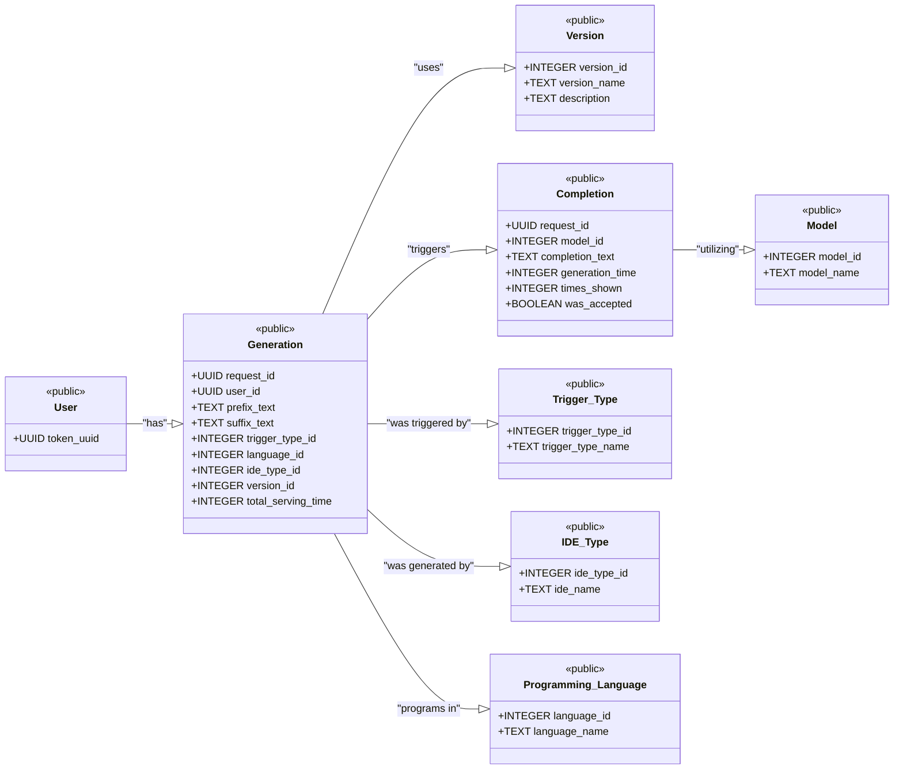
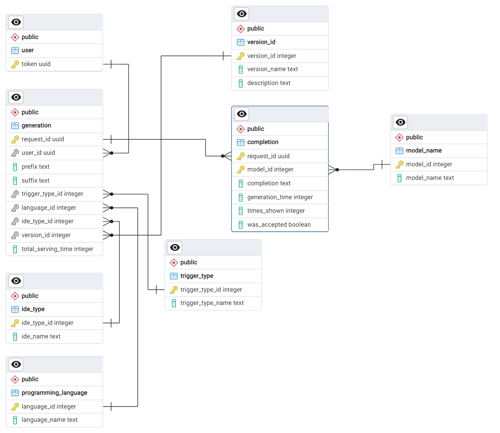

## Database Schema for CoCo

**Note: image of database design available at the end of the document**

## Tables
### `user`
This is the table which contains the list of all the valid identification tokens for the users.
This table can therefore also be used to very the fact that a user is a valid user or not upon request.

- **`token_uuid: UUID`** Unique identifier for the user, **Primary Key**. 

### `version_id`
This table contains the list of all the versions of the plugin that are available.
The (optional) description field can be used to provide a brief description of the version and the changes that have been made in the version.

- `version_id: INTEGER` Unique identifier for the version.
- **`version_name: TEXT`** Name of the (semantic) version, **Primary Key**. 
- `description: TEXT` Description of the version, *Optional*.

> [!NOTE]: does it not make more sense to merge `version_name` and `version_id` into one field? If we use semantic versioning; this should suffice as an identifier. I.e. just have a field `version_id: TEXT` containing the semantic version. 
> In fact, I would actually put this under `ide_type`, given that we may have different versions per IDE. Ideally we would keep the versions between different IDEs in sync, but in the real world we will run into bugs and probably push `x.x.1` little updates to each plugin. So my proposal becomes:

```
# plugin_version
- `version_id`: primary key
- `ide_type`: primary key
- `description`: text

query has plugin_version (rather than both ide_type and version_id)
plugin_version has ide_type 
```

### `trigger_type`
This table contains the list of all the trigger types that are available.
The trigger types are used to determine the type of trigger that is used to generate the code.

- **`trigger_type_id: INTEGER`** Unique identifier for the trigger type, **Primary Key**.
- `trigger_type_name: TEXT` Name of the trigger type.

### `ide_type`
This table contains the list of all the IDE types that are available.
The IDE types are used to determine the name/type of IDE that is used to generate the code.

- **`ide_type_id: INTEGER`** Unique identifier for the IDE type, **Primary Key**.
- `ide_name: TEXT` Name of the IDE used.

### `programming_language`
This table contains the list of all the programming languages that are available.
The programming languages are used to determine the language in which the code is generated.

- **`language_id: INTEGER`** Unique identifier for the programming language, **Primary Key**.
- `language_name: TEXT` Name of the programming language.

### `model_name`
This table contains the list of all the models that are available.
The models are used to determine the model that is used to generate the code.

- **`model_id: INTEGER`** Unique identifier for the model, **Primary Key**.
- `model_name: TEXT` Name of the model.

> [!NOTE] Is it necessary for `trigger_type`, `ide_type`, `programming_language`, and `model_name` to be their own tables? I'm not sure if this works with the database libraries you're using (or whether it remains 3NF), but a flatter layout can be more desirable for easier understanding. 

> For instance, say I'm given a completion; to figure out whether it was invoked in `jetbrains` I need to look up the `ide_type_id` and then its corresponding `ide_name`. For someone not familiar with the plugin, knowing what values this can take requires exploring each table; and potentially keeping track of nesting and ids in data analysis. 

> I'm not sure if there is a better way of doing it, you probably know better. If the option exists, I would add these four as (extensible) enum values on the `completion` table. Otherwise, can you explain to me why this is better (e.g. I don't have enough experience with databases to know whether these things are automatically flattened when retrieving a `generation`)


### `query`

> [!NOTE] Rename `generation` to `query` to completely avoid ambiguity with the `completion` table. I chose not to use `request` to not overload this term often used in the code itself as well. I like the metadata/actual code separation; 

> I've classified fields based on whether they are computed server/client side. We will probably extend the client-side one a lot during the studies we do, e.g. with last 5 actions, current typing speed, etc.

This table contains the list of all the generations that have been requested.
This table contains only the metadata of the generation request and not the actual code that has been generated.

###### Computed Server-Side

- **`request_id: UUID`** for the generation request, **Primary Key**.
- `total_serving_time: INTEGER` total request processing time, in milliseconds.
- `timestamp:` **please add this field and its datatype**; it may also be useful to pre-compute the time since the last completion (in ms) per user, as this is a strong indicator on whether it is necessary to generate a completion in the first place. `time_since_last_completion` should be part of the `generation`, i.e. not stored as a mutable field under the `user`; in case we build a classifier that depends on several of the previous requests. 

###### Computed Client-Side

- `user_id: UUID` &rarr; [`user`](#user) who requested the generation.
- `prefix_text: TEXT` before the cursor.
- `suffix_text: TEXT` after the cursor.
- `trigger_type_id: INTEGER` &rarr; [`trigger_type`](#trigger_type) ID for the trigger type used.
- `language_id: INTEGER` &rarr; [`programming_language`](#programming_language) ID for the programming language used.
- `ide_type_id: INTEGER` &rarr; [`ide_type`](#ide_type) ID for the IDE type used.
- `version_id: INTEGER` &rarr; [`version_id`](#version_id) ID for the version used.

### `generation`

This table contains all the completions that have been generated; the actual code as well as generation-related metadata. 

###### Computed Server-Side
- **`request_id: UUID`** &rarr; [`generation`](#generation) Unique identifier for the generation request, **Primary Key**. 
- **`model_id: INTEGER`** &rarr; [`model_name`](#model_name) ID for the model used, **Primary Key**.
- `completion_text: TEXT` The code that has been generated.
- `generation_time: INTEGER` Time taken to generate the code, in milliseconds.

- `confidence: FLOAT` **add: confidence of the model**; in the future we will likely also want to maintain generation kwargs like `temperature`.

###### Computed Client-Side (& MUTABLE)
> [!NOTE] you should store `times_shown` as a list of `timestamps` the completion was shown at, rather than the number of times. Also, keep in mind that this value does not exist at first. The server generates a completion, sends it to the client; the client may or may not show the completion, and may show it at different times; after which it is sent back to the server to update this field. 

- `times_shown: INTEGER` Number of times the completion has been shown.
- `was_accepted: BOOLEAN` Whether the completion was accepted or not.


## General Notes
- The database has been designed in a way to enable modularity and scalability.
  - With the given schema it becomes very simple to add new models, trigger types, IDE types, programming languages, and versions.
  - The schema has been normalized to be in 3NF to minimize complications that might arise as the result of anomalies.
  - The schema has been designed to be scalable and can be easily extended to include more tables and fields as required.
- The database has been designed to favor OLTP operations over OLAP operations in order to provide a faster response time for the users.
- The database has been designed to be used with a REST API.

## design decisions
- given that the ground truth need not be one of the completions generated, we assume that any model_id lower than 0 is the ground truth as provided by the user. This means that a value for `model_id` lower than 0 does not link to an entry in the `model_name` table but rather the user. This entry is only added to the database iff the verification of the request by the user indicates the use of another answer besides that included in the completions.
  - **Let's not do this. When we extend `generation` with additional metadata, we may not want to extend the `ground_truth`. Also, we want to be able to store `ground_truth`s at different timestamps (e.g. after 30s up to 30 days), to see if the code changes over time ([adoption of AI correlates with code churn](https://www.gitclear.com/coding_on_copilot_data_shows_ais_downward_pressure_on_code_quality))**
- all times which are stored as integers are stored in milliseconds. This is to ensure that the time taken to generate the code is stored in a consistent manner.
- a cascade of deletion has been implemented based upon the foreign key constraint of `request_id` in the table `completion`. This is to ensure that when a generation request is deleted, all the completions associated with that request are also deleted. This is to ensure that the database does not contain any orphaned entries.
- as per the design of postgreSQL the `TEXT` datatype is used to store large amounts of text. This is to ensure that the database can store the code that has been generated without any truncation. (this is synonymous with the `CLOB` datatype in Oracle and the `TEXT` datatype in MySQL)
- the designs have been exclusively tested on postgreSQL and as such the syntax used in the initialization script is specific to postgreSQL. The script may need to be modified to work with other SQL databases.

The initialization script for the database can be found [here](./init.sql)
The PGERD file for the database can be found [here](../resources/desgin_files/db_schema.pgerd)

## TODO

#### Code Context for Retrieval-Augmented Generation
In the design process of the database, we need to think about how we will implement prefix/suffix/file storing. Copilot uses a highly custom prompt, incorporating snippets from relevant files as well as libraries. This is something we will want to copy rather sooner than later, so it's important. Specifically, we need to think of the following tradeoff/spectrum:

1. On the one hand, we can pre-compute the entire prompt for the model on the client side.
2. On the other hand, we can send all relevant information to the server, and compute the prompt on the server side. 

I'm in favour of option 2 as much as is possible, as it allows more flexibility in subsequent data analysis, as well as the option to do A/B prompt studies. But, it requires us to think more about the design of the database. Perhaps it makes sense to divide the `request` metadata into two types: 

- `code` containing the currently open file, its language, cursor position, related files, and API docstrings. 
- `telemetry` containing IDE-collected variables like the typing speed, potential completion settings, etc. 

Telemetry is pretty much unique on every request, so this should be easy to add. Code, on the other hand, can be shared between requests and we need to think of the most optimal way to store it. I think we should explore [`tree-sitter`](https://tree-sitter.github.io/tree-sitter/) for parsing the AST/dependency tree on the client side, and then handle storing nodes in this tree on the server-side. Specifically:

- The client parses the AST, and figures out whether there are diffs for a given node; This means we can minimise the request message size, only transmitting the info that is necessary. 
- The server stores the AST and checks if there are *library*-dependencies it has stored already.

<!-- These were my notes as I was formulating my thoughts
- A user will likely request a completion many times when in the same file. 
  - Is it fine to store just the cursor position on subsequent requests along with a diff of the file? 
  - I think? it is safe to assume uniqueness between users when it comes to their files. 
- Related files may also be changed over time
- API calls may be shared among users, how do we avoid storing common libraries' documentation (`numpy`, `pandas`) more than once?

```python
@dataclass
class File:
  content: str 

  open?: bool # whether this is the currently open file. 
  position?: (column: int, offset: int) # we need to be very delicate here to ensure we are at the exact location
                                       # i.e. write a lot, lot of tests. 
  language: languageid
```
-->


#### User Patterns over Time
We will probably add more customisation options for users like the ability to turn off completions on a given language, or to use ghost-text style completion instead of Intellisense-style. It would be nice to put in a table to keep track of user settings and how they evolve over time as well. 

---
#### Image of database design


